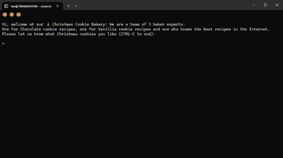

## OPENAI SWARM MULTI-AGENT EXAMPLE

## 🎄Christmas Cookie Bakery 🎄

### INTRO

A simple Python code that demonstrates the orchestration of several OpenAI Swam agents. In our scenario we have a Christmas bakery with a chocolate cookie expert, a vanilla cookie expert and an expert who can search for recipes on the Internet. For all other requests there is a kitchen helper who tries to find an answer. A chef baker takes the User input and transfers the request to the the expert agents (bakers)

Iht internet agent demonstrates an Agent API request with  DuckDuckgo to search cookie recipes webpages from the internet.  

This example is leverages a local LLM instance of LLAMA3.2. 




### INSTALLATION

Follow Instructions for pre-requisites here:

OPEN AI SWARM: 

[GitHub - openai/swarm: Educational framework exploring ergonomic, lightweight multi-agent orchestration. Managed by OpenAI Solution team.](https://github.com/openai/swarm)

OLLAMA: 

[GitHub - ollama/ollama: Get up and running with Llama 3.2, Mistral, Gemma 2, and other large language models.](https://github.com/ollama/ollama)

Create python environment:

```
mkdir swarm
python3 -m venv swarm
source swarm/bin/activate
ollama pull llama3.2
pip3 install git+ssh://git@github.com/openai/swarm.git
pip3 pip install duckduckgo-search
```

Define parametes:

```
export OPENAI_API_KEY=fake-key
export OPENAI_MODEL_NAME=llama3.2
export OPENAI_BASE_URL=http://localhost:11434/v1
```

### RUN

```
python3 christmasbakery.py
```
